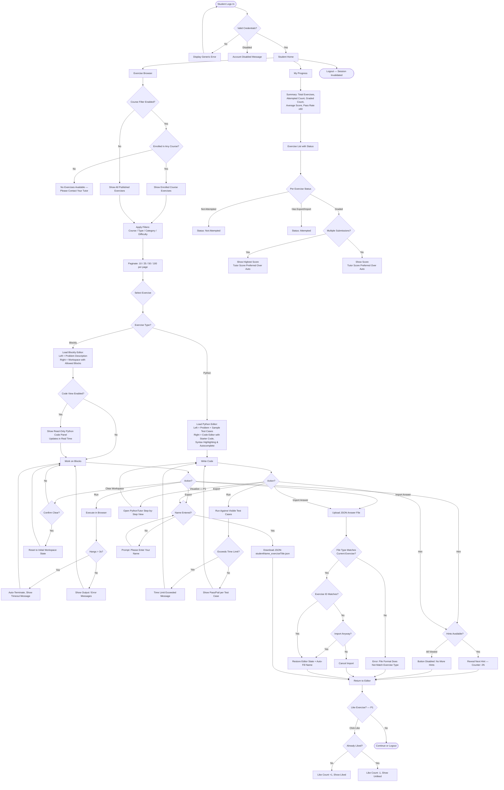

```mermaid
flowchart TD
    Start([Student Logs In]) --> AuthCheck{Valid Credentials?}
    AuthCheck -->|No| AuthErr[Display Generic Error]
    AuthErr --> Start
    AuthCheck -->|Disabled| DisabledMsg[Account Disabled Message]
    AuthCheck -->|Yes| Home[Student Home]

    Home --> Browse[Exercise Browser]
    Home --> Progress[My Progress]

    %% === Exercise Browser ===
    Browse --> FilterCheck{Course Filter Enabled?}
    FilterCheck -->|Yes| EnrollCheck{Enrolled in Any Course?}
    EnrollCheck -->|No| EmptyMsg[No Exercises Available —\nPlease Contact Your Tutor]
    EnrollCheck -->|Yes| ExList[Show Enrolled Course Exercises]
    FilterCheck -->|No| ExList2[Show All Published Exercises]

    ExList --> Filter[Apply Filters:\nCourse / Type / Category / Difficulty]
    ExList2 --> Filter
    Filter --> Paginate[Paginate: 10 / 25 / 50 / 100 per page]
    Paginate --> SelectEx{Select Exercise}

    SelectEx --> TypeCheck{Exercise Type?}

    %% === Blockly Editor ===
    TypeCheck -->|Blockly| BEditor[Load Blockly Editor:\nLeft = Problem Description\nRight = Workspace with Allowed Blocks]
    BEditor --> BCodeView{Code View Enabled?}
    BCodeView -->|Yes| BCodePanel[Show Read-Only Python Code Panel\nUpdates in Real Time]
    BCodeView -->|No| BWork[Work on Blocks]
    BCodePanel --> BWork[Work on Blocks]

    BWork --> BAction{Action?}
    BAction -->|Run| BExec[Execute in Browser]
    BExec --> BTimeout{Hangs > 3s?}
    BTimeout -->|Yes| BKill[Auto-Terminate, Show Timeout Message]
    BTimeout -->|No| BOutput[Show Output / Error Messages]
    BKill --> BWork
    BOutput --> BWork

    BAction -->|Hint| HintFlow
    BAction -->|Clear Workspace| BClearConfirm{Confirm Clear?}
    BClearConfirm -->|Yes| BReset[Reset to Initial Workspace State]
    BClearConfirm -->|No| BWork
    BReset --> BWork

    BAction -->|Import Answer| ImportFlow
    BAction -->|Export| ExportFlow

    %% === Python Editor ===
    TypeCheck -->|Python| PEditor[Load Python Editor:\nLeft = Problem + Sample Test Cases\nRight = Code Editor with Starter Code,\nSyntax Highlighting & Autocomplete]

    PEditor --> PWork[Write Code]
    PWork --> PAction{Action?}

    PAction -->|Run| PExec[Run Against Visible Test Cases]
    PExec --> PTimeCheck{Exceeds Time Limit?}
    PTimeCheck -->|Yes| PTLE[Time Limit Exceeded Message]
    PTimeCheck -->|No| PResults[Show Pass/Fail per Test Case]
    PTLE --> PWork
    PResults --> PWork

    PAction -->|Hint| HintFlow
    PAction -->|Visualize — P1| PViz[Open PythonTutor Step-by-Step View]
    PViz --> PWork

    PAction -->|Import Answer| ImportFlow
    PAction -->|Export| ExportFlow

    %% === Hint Flow ===
    HintFlow{Hints Available?}
    HintFlow -->|Yes| ShowHint[Reveal Next Hint — Counter: i/N]
    HintFlow -->|All Viewed| HintDisabled[Button Disabled: No More Hints]
    ShowHint --> ReturnWork[Return to Editor]
    HintDisabled --> ReturnWork

    %% === Import Flow ===
    ImportFlow[Upload JSON Answer File] --> ImpTypeMatch{File Type Matches\nCurrent Exercise?}
    ImpTypeMatch -->|No| ImpTypeErr[Error: File Format Does Not Match Exercise Type]
    ImpTypeMatch -->|Yes| ImpExMatch{Exercise ID Matches?}
    ImpExMatch -->|No| ImpExWarn{Import Anyway?}
    ImpExWarn -->|Yes| ImpRestore[Restore Editor State + Auto-Fill Name]
    ImpExWarn -->|No| ImpCancel[Cancel Import]
    ImpExMatch -->|Yes| ImpRestore

    ImpTypeErr --> ReturnWork
    ImpCancel --> ReturnWork
    ImpRestore --> ReturnWork

    %% === Export Flow ===
    ExportFlow{Name Entered?}
    ExportFlow -->|No| NamePrompt[Prompt: Please Enter Your Name]
    NamePrompt --> ExportFlow
    ExportFlow -->|Yes| Download[Download JSON:\nstudentName_exerciseTitle.json]
    Download --> ReturnWork

    %% === Like — P1 ===
    ReturnWork --> LikeCheck{Like Exercise? — P1}
    LikeCheck -->|Click Like| AlreadyLiked{Already Liked?}
    AlreadyLiked -->|No| AddLike[Like Count +1, Show Liked]
    AlreadyLiked -->|Yes| RemoveLike[Like Count -1, Show Unliked]
    LikeCheck -->|No| Done

    %% === Progress Page ===
    Progress --> ProgSummary[Summary: Total Exercises,\nAttempted Count, Graded Count,\nAverage Score, Pass Rate ≥60]
    ProgSummary --> ProgList[Exercise List with Status]
    ProgList --> ProgStatus{Per Exercise Status}
    ProgStatus -->|Not Attempted| StatusNA[Status: Not Attempted]
    ProgStatus -->|Has Export/Import| StatusAttempted[Status: Attempted]
    ProgStatus -->|Graded| StatusGraded{Multiple Submissions?}
    StatusGraded -->|Yes| ShowHighest[Show Highest Score\nTutor Score Preferred Over Auto]
    StatusGraded -->|No| ShowScore[Show Score\nTutor Score Preferred Over Auto]

    Done([Continue or Logout])

    Home --> Logout([Logout — Session Invalidated])
```