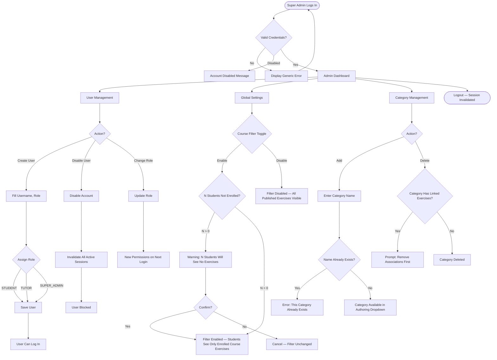

```mermaid
flowchart TD
    Start([Super Admin Logs In]) --> AuthCheck{Valid Credentials?}
    AuthCheck -->|No| AuthErr[Display Generic Error]
    AuthErr --> Start
    AuthCheck -->|Disabled| DisabledMsg[Account Disabled Message]
    AuthCheck -->|Yes| Dashboard[Admin Dashboard]

    Dashboard --> UM[User Management]
    Dashboard --> GS[Global Settings]
    Dashboard --> CM[Category Management]

    %% User Management
    UM --> UM_Action{Action?}
    UM_Action -->|Create User| UM_Create[Fill Username, Role]
    UM_Create --> UM_RoleSelect{Assign Role}
    UM_RoleSelect -->|STUDENT| UM_Save[Save User]
    UM_RoleSelect -->|TUTOR| UM_Save
    UM_RoleSelect -->|SUPER_ADMIN| UM_Save
    UM_Save --> UM_Done[User Can Log In]

    UM_Action -->|Disable User| UM_Disable[Disable Account]
    UM_Disable --> UM_Invalidate[Invalidate All Active Sessions]
    UM_Invalidate --> UM_Done2[User Blocked]

    UM_Action -->|Change Role| UM_ChangeRole[Update Role]
    UM_ChangeRole --> UM_RoleApplied[New Permissions on Next Login]

    %% Global Settings
    GS --> GS_Toggle{Course Filter Toggle}
    GS_Toggle -->|Enable| GS_Impact{N Students Not Enrolled?}
    GS_Impact -->|N > 0| GS_Warn[Warning: N Students Will See No Exercises]
    GS_Warn --> GS_Confirm{Confirm?}
    GS_Confirm -->|Yes| GS_On[Filter Enabled — Students See Only Enrolled Course Exercises]
    GS_Confirm -->|No| GS_Cancel[Cancel — Filter Unchanged]
    GS_Impact -->|N = 0| GS_On
    GS_Toggle -->|Disable| GS_Off[Filter Disabled — All Published Exercises Visible]

    %% Category Management
    CM --> CM_Action{Action?}
    CM_Action -->|Add| CM_Add[Enter Category Name]
    CM_Add --> CM_DupCheck{Name Already Exists?}
    CM_DupCheck -->|Yes| CM_DupErr[Error: This Category Already Exists]
    CM_DupCheck -->|No| CM_Saved[Category Available in Authoring Dropdown]

    CM_Action -->|Delete| CM_HasEx{Category Has Linked Exercises?}
    CM_HasEx -->|Yes| CM_Block[Prompt: Remove Associations First]
    CM_HasEx -->|No| CM_Del[Category Deleted]

    Dashboard --> Logout([Logout — Session Invalidated])
```