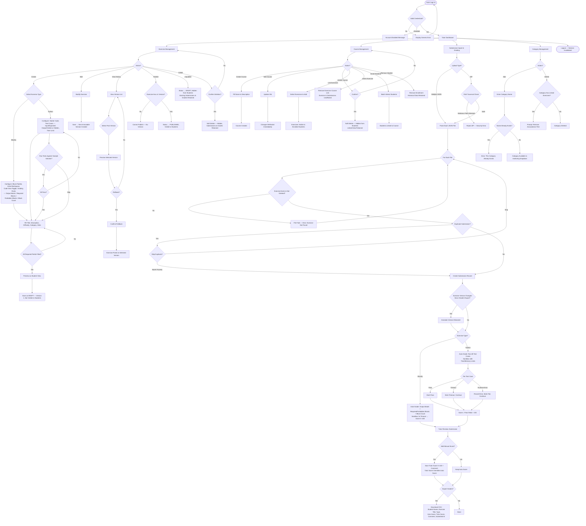

```mermaid
flowchart TD
    Start([Tutor Logs In]) --> AuthCheck{Valid Credentials?}
    AuthCheck -->|No| AuthErr[Display Generic Error]
    AuthErr --> Start
    AuthCheck -->|Disabled| DisabledMsg[Account Disabled Message]
    AuthCheck -->|Yes| Dashboard[Tutor Dashboard]

    Dashboard --> EX[Exercise Management]
    Dashboard --> CO[Course Management]
    Dashboard --> GR[Submission Import & Grading]
    Dashboard --> CM[Category Management]

    %% === Exercise Management ===
    EX --> EX_Action{Action?}

    EX_Action -->|Create| EX_Type{Select Exercise Type}
    EX_Type -->|Blockly| EX_BConfig[Configure: Block Palette, Initial Workspace,\nCode View Toggle, Grading Rules\n— Output Match / Required Blocks /\nForbidden Blocks / Block Count]
    EX_Type -->|Python| EX_PConfig[Configure: Starter Code,\nTest Cases — Input/Expected Output/Visible or Hidden,\nTime Limit]
    EX_BConfig --> EX_Fields[Fill Title, Description, Difficulty, Category, Hints]
    EX_PConfig --> EX_Fields
    EX_PConfig --> EX_Verify{Run Tests Against Sample Solution?}
    EX_Verify -->|Yes| EX_VerifyResult{All Pass?}
    EX_VerifyResult -->|No| EX_PConfig
    EX_VerifyResult -->|Yes| EX_Fields
    EX_Verify -->|Skip| EX_Fields
    EX_Fields --> EX_ReqCheck{All Required Fields Filled?}
    EX_ReqCheck -->|No| EX_Fields
    EX_ReqCheck -->|Yes| EX_Preview[Preview as Student View]
    EX_Preview --> EX_SaveDraft[Save as DRAFT — Version 1, Not Visible to Students]

    EX_Action -->|Edit| EX_Edit[Modify Exercise]
    EX_Edit --> EX_NewVer[Save → New Immutable Version Created]

    EX_Action -->|View History| EX_History[View Version List]
    EX_History --> EX_SelectVer{Select Past Version}
    EX_SelectVer --> EX_VerPreview[Preview Selected Version]
    EX_VerPreview --> EX_Rollback{Rollback?}
    EX_Rollback -->|Yes| EX_RBConfirm[Confirm Rollback]
    EX_RBConfirm --> EX_RBDone[Exercise Points to Selected Version]
    EX_Rollback -->|No| EX_History

    EX_Action -->|Publish| EX_PubCheck{Exercise Has ≥1 Version?}
    EX_PubCheck -->|No| EX_PubBlock[Cannot Publish — No Version]
    EX_PubCheck -->|Yes| EX_Publish[Status → PUBLISHED, Visible to Students]

    EX_Action -->|Unpublish| EX_Unpub[Status → DRAFT, Hidden from Students\nExisting Submissions & Grades Retained]

    EX_Action -->|Delete| EX_DelConfirm{Confirm Deletion?}
    EX_DelConfirm -->|Yes| EX_SoftDel[Soft-Delete — Hidden, Submissions & Grades Retained]
    EX_DelConfirm -->|No| EX

    %% === Course Management ===
    CO --> CO_Action{Action?}

    CO_Action -->|Create Course| CO_Create[Fill Name & Description]
    CO_Create --> CO_Saved[Course Created]

    CO_Action -->|Edit Course| CO_Edit[Update Info]
    CO_Edit --> CO_Updated[Changes Reflected Immediately]

    CO_Action -->|Delete Course| CO_DelConfirm{Confirm?}
    CO_DelConfirm -->|Yes| CO_SoftDel[Soft-Delete — Hidden from Students\nLinked Data Retained]
    CO_DelConfirm -->|No| CO

    CO_Action -->|Link Exercises| CO_LinkEx[Select Exercises to Add]
    CO_LinkEx --> CO_Linked[Exercises Visible to Enrolled Students]

    CO_Action -->|Unlink Exercise| CO_Unlink[Remove Exercise–Course Link\nExercise & Submissions Unaffected]

    CO_Action -->|Enroll Students| CO_Enroll[Batch-Select Students]
    CO_Enroll --> CO_Enrolled[Students Linked to Course]

    CO_Action -->|Remove Student| CO_RemoveStudent[Remove Enrollment\nHistorical Data Retained]

    %% === Grading ===
    GR --> GR_Upload{Upload Type?}
    GR_Upload -->|Multiple JSON| GR_Parse[Parse Each JSON File]
    GR_Upload -->|ZIP| GR_Extract{Path Traversal Check}
    GR_Extract -->|Malicious Path Detected| GR_Reject[Reject ZIP — Security Error]
    GR_Extract -->|Safe| GR_Parse

    GR_Parse --> GR_FileLoop{For Each File}
    GR_FileLoop --> GR_ExCheck{Exercise Exists & Not Deleted?}
    GR_ExCheck -->|No| GR_FileErr[File Fails — Error: Exercise Not Found]
    GR_ExCheck -->|Yes| GR_DupCheck{Duplicate Submission?}
    GR_DupCheck -->|Yes| GR_DupPrompt{Skip Duplicate?}
    GR_DupPrompt -->|Skip| GR_FileLoop
    GR_DupPrompt -->|Import Anyway| GR_CreateSub
    GR_DupCheck -->|No| GR_CreateSub[Create Submission Record]

    GR_CreateSub --> GR_VerCheck{Exercise Version Changed\nSince Student Export?}
    GR_VerCheck -->|Yes| GR_Annotate[Annotate Version Mismatch]
    GR_VerCheck -->|No| GR_AutoGrade

    GR_Annotate --> GR_AutoGrade{Exercise Type?}
    GR_AutoGrade -->|Blockly| GR_BG[Auto-Grade: Output Match +\nRequired/Forbidden Blocks + Block Count\nSandbox 3s Timeout → Score 0–100]
    GR_AutoGrade -->|Python| GR_PG[Auto-Grade: Run All Test Cases\nSandbox with Time/Memory Limits]

    GR_PG --> GR_PGCase{Per Test Case}
    GR_PGCase -->|Pass| GR_PGNext[Mark Pass]
    GR_PGCase -->|Timeout| GR_PGTimeout[Mark Timeout, Continue]
    GR_PGCase -->|Runtime Error| GR_PGError[Record Error, Mark Fail, Continue]
    GR_PGNext --> GR_PGScore[Score = Pass Ratio × 100]
    GR_PGTimeout --> GR_PGScore
    GR_PGError --> GR_PGScore

    GR_BG --> GR_Review
    GR_PGScore --> GR_Review[Tutor Reviews Submission]

    GR_Review --> GR_Manual{Add Manual Score?}
    GR_Manual -->|Yes| GR_ManualSave[Save Tutor Score 0–100 + Comment\nTutor Score Overrides Auto Score]
    GR_Manual -->|No| GR_KeepAuto[Keep Auto Score]

    GR_ManualSave --> GR_Export
    GR_KeepAuto --> GR_Export{Export Grades?}
    GR_Export -->|Yes| GR_CSV[Download CSV:\nStudent Name, Exercise Title, Type,\nAuto Score, Tutor Score, Comment, Submitted At]
    GR_Export -->|No| GR_Done[Done]

    GR_FileErr --> GR_FileLoop

    %% === Category Management ===
    CM --> CM_Action{Action?}
    CM_Action -->|Add| CM_Add[Enter Category Name]
    CM_Add --> CM_DupCheck{Name Already Exists?}
    CM_DupCheck -->|Yes| CM_DupErr[Error: This Category Already Exists]
    CM_DupCheck -->|No| CM_Saved[Category Available in Authoring Dropdown]

    CM_Action -->|Delete| CM_HasEx{Category Has Linked Exercises?}
    CM_HasEx -->|Yes| CM_Block[Prompt: Remove Associations First]
    CM_HasEx -->|No| CM_Del[Category Deleted]

    Dashboard --> Logout([Logout — Session Invalidated])
```